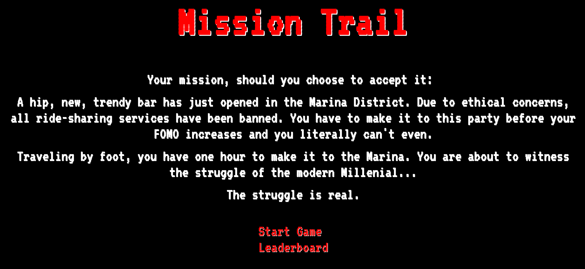
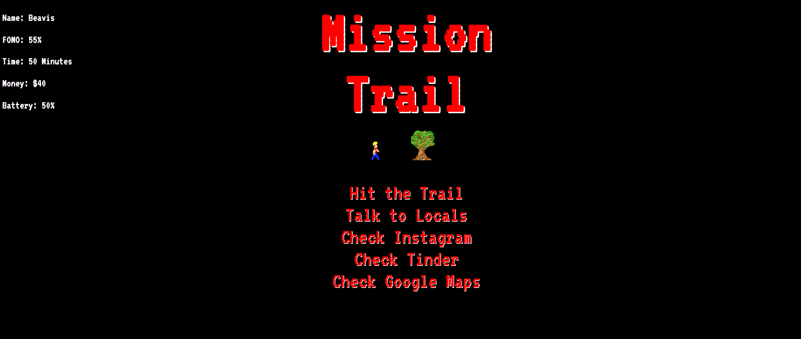
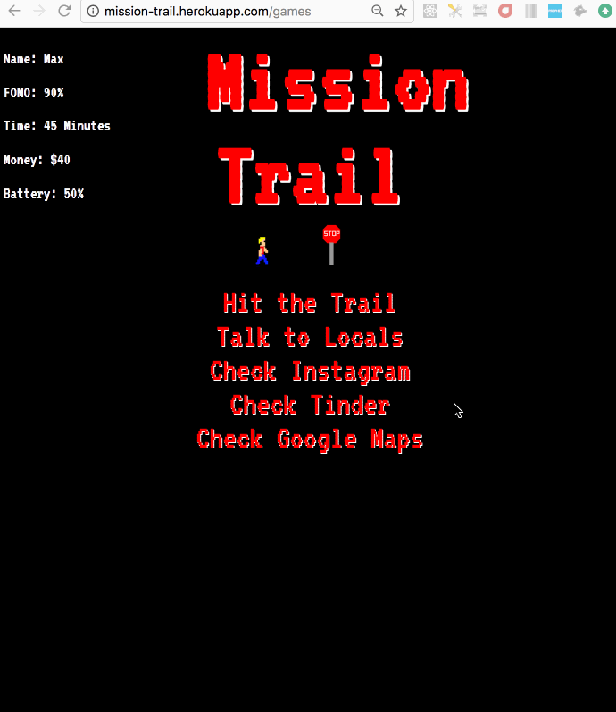

# 🌁 Mission Trail 🌁

### A text-based adventure game clone of The Oregon Trail video game updated for the Millennial generation.
* Millennials are the first generation to be burdened by FOMO, or the fear of missing out, due to constant connectivity to the internet.     In this game, the user encounters situations familiar to the modern-day Millennial, and must strategically choose options that keep       their FOMO score low.
* Completed by a team of 4 individuals bound by the nostalgia of a childhood  game and a love for satirizing the trends of our generation.   Built under a time constraint of 8 days and ending in a successful demo.

## Contributors

* [Aaron Calander](https://www.linkedin.com/in/aaroncalander) / Front-End Lead Developer : <https://github.com/aaroncalander>
* [Jesse Calton](https://www.linkedin.com/in/jessecalton) / Full Stack Developer : <https://github.com/jessecalton>
* [Chris Huynh](https://www.linkedin.com/in/christopher-huynh-28121a76) / Back-End Developer : <https://github.com/ChHuynh>
* [Vilde Vevatne](https://www.linkedin.com/in/vilde-vevatne) / Audio/Back-End Developer : <https://github.com/vildevev>

## Tech Stack

* Ruby on Rails
* CSS3
* HTML5
* PostgreSQL
* ConsoleCam

## Demo

## Deployment

The finished application can be viewed by visiting:

<https://www.mission-trail.herokuapps.com>
